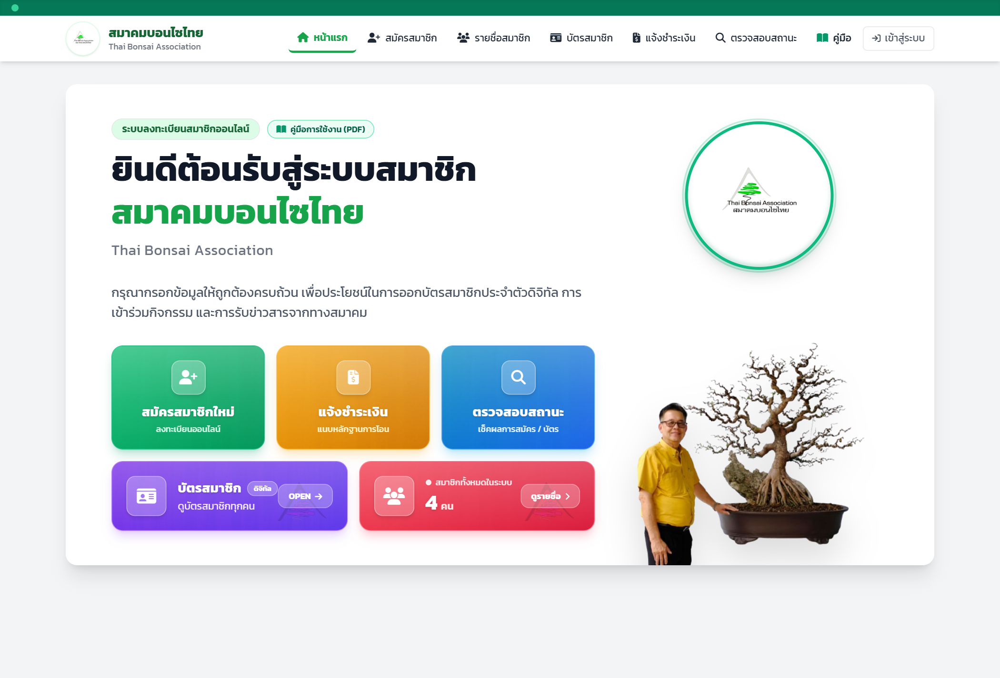
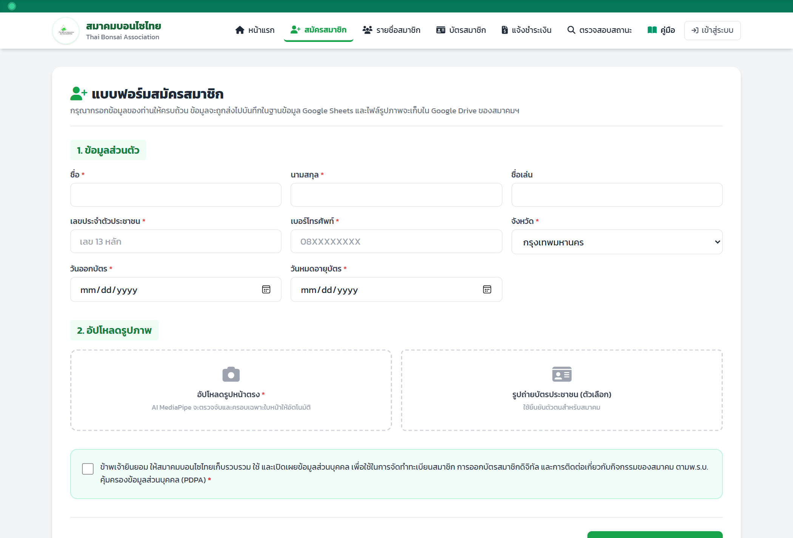
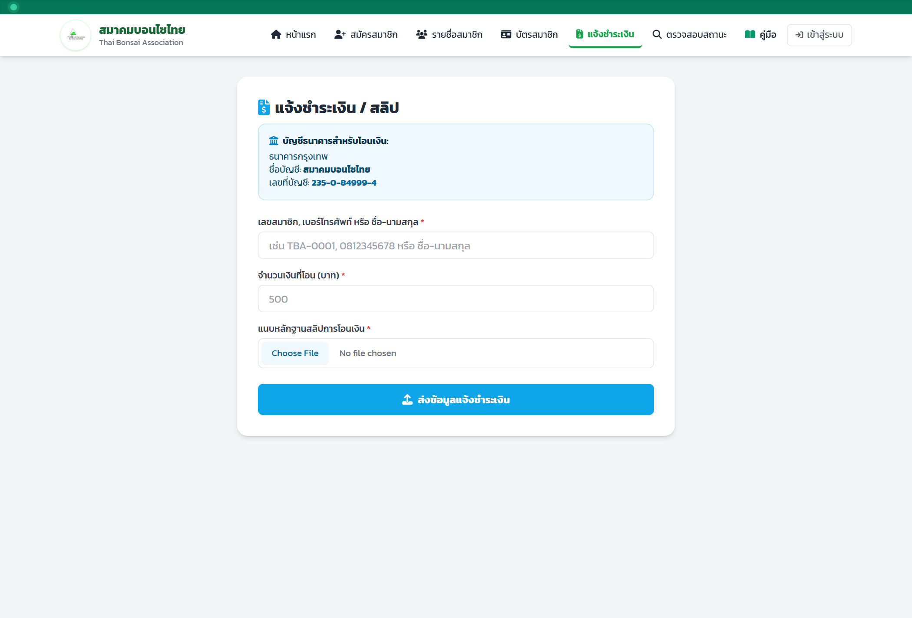
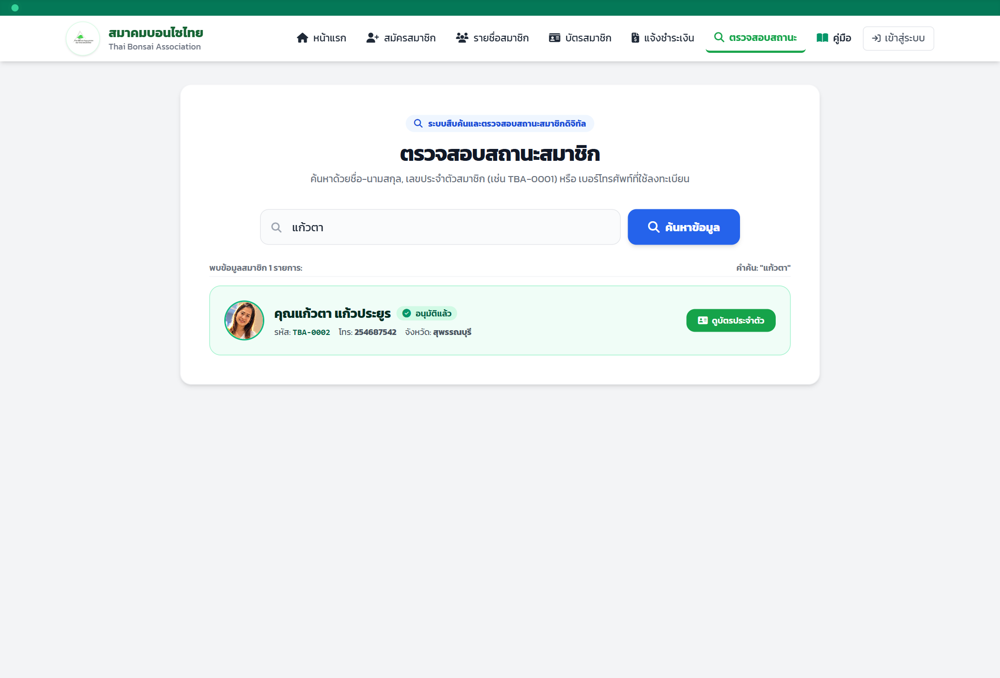
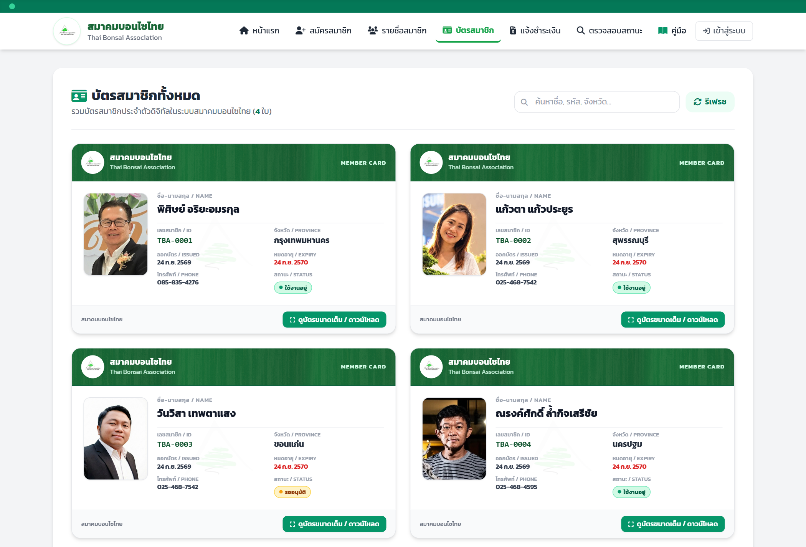
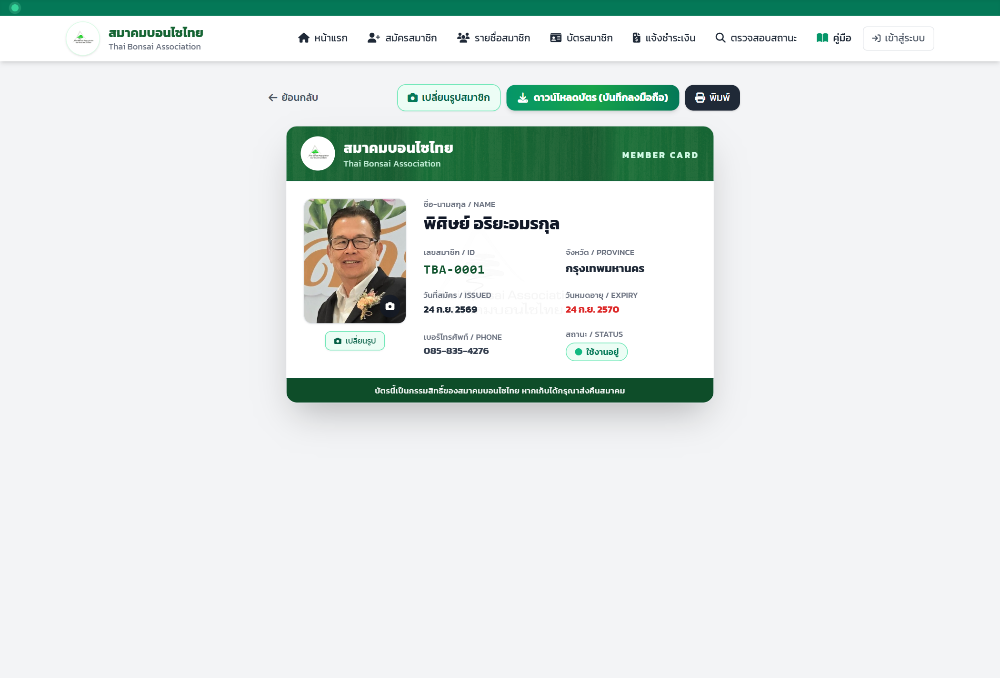
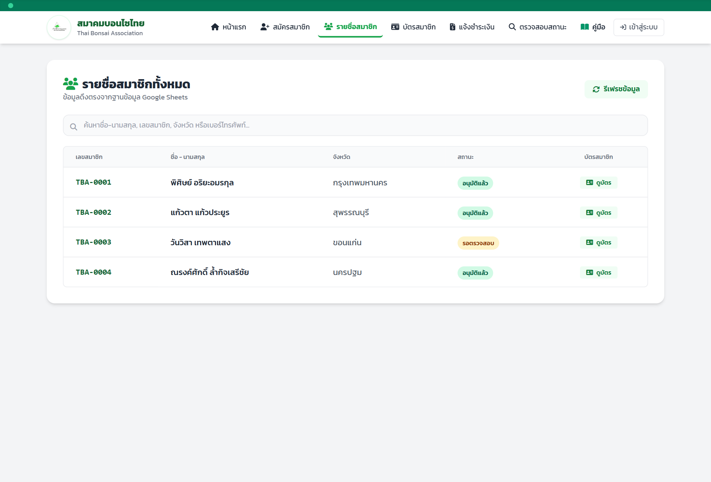
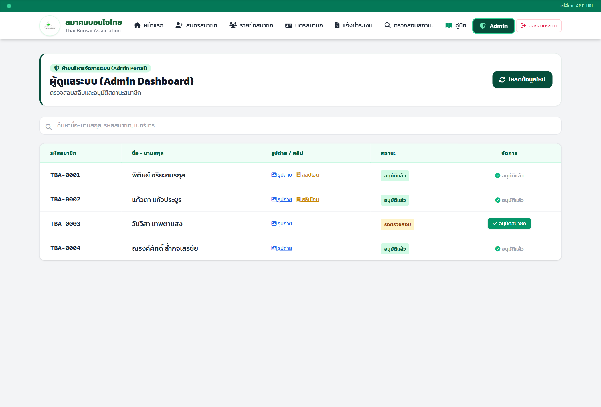

# คู่มือการใช้งานระบบทะเบียนสมาชิก สมาคมบอนไซไทย
**Thai Bonsai Association (TBA) - Member Portal User Manual**

---

ระบบทะเบียนสมาชิก สมาคมบอนไซไทย เป็นระบบสารสนเทศสำหรับการจัดการสมาชิก ออกบัตรประจำตัวดิจิทัล (Digital Membership Card พร้อม QR Code) การแจ้งชำระเงิน และการตรวจสอบสถานะแบบครบวงจร โดยเชื่อมโยงฐานข้อมูลแบบเรียลไทม์กับ Google Sheets และ Google Drive

---

## สารบัญคู่มือ
1. [หน้าหลัก (Home Page)](#1-หน้าหลัก-home-page)
2. [ระบบสมัครสมาชิกใหม่ (Member Registration & AI Crop)](#2-ระบบสมัครสมาชิกใหม่-member-registration)
3. [ระบบแจ้งชำระเงิน (Payment Submission)](#3-ระบบแจ้งชำระเงิน-payment-submission)
4. [ระบบตรวจสอบสถานะสมาชิก (Status Tracking)](#4-ระบบตรวจสอบสถานะสมาชิก-status-tracking)
5. [คลังบัตรสมาชิกดิจิทัลทั้งหมด (All Member Cards Gallery)](#5-คลังบัตรสมาชิกดิจิทัลทั้งหมด-all-member-cards-gallery)
6. [หน้ารายละเอียดและดาวน์โหลดบัตรสมาชิก (Member Card Detail & Download)](#6-หน้ารายละเอียดและดาวน์โหลดบัตรสมาชิก-member-card-detail--download)
7. [ระบบฐานข้อมูลและเมนูเจ้าหน้าที่ (Admin & Database Portal)](#7-ระบบฐานข้อมูลและเมนูเจ้าหน้าที่-admin--database-portal)

---

## 1. หน้าหลัก (Home Page)

หน้าแรกของระบบได้รับการออกแบบอย่างสง่างาม แบ่งพื้นที่ออกเป็นสัดส่วน 2:1 ที่ลงตัว:
- **ฝั่งซ้าย (2 ใน 3 ส่วน)**: แถบต้อนรับทางการ คำแนะนำการใช้งาน และ **ปุ่มเมนูด่วน 5 รายการ (จัดเรียง 2 แถว)** โทนสีสดใสสะดุดตาพร้อมลายเส้นไม้ธรรมชาติของการ์ดสมาชิก
- **ฝั่งขวา (1 ใน 3 ส่วน)**: ตราสัญลักษณ์โลโก้สมาคมบอนไซไทยทรงกลมแบบ **3 มิติ (3D Beveled Medallion)** พร้อมภาพบุคคลและต้นบอนไซที่วางชิดขอบล่างสุดอย่างภูมิฐาน
- **แถบเมนูด้านบน (Navbar)**: มีปุ่มลัด **"คู่มือ"** พร้อมไอคอนหนังสือสีเขียวมรกต เพื่อเปิดคู่มือฉบับเต็มและดาวน์โหลด PDF ได้ทันที

### รายละเอียดปุ่มเมนูด่วน 5 รายการ:
| แถว | รายการ | โทนสี | หน้าที่การทำงาน |
| :--- | :--- | :--- | :--- |
| **แถวที่ 1** | **สมัครสมาชิกใหม่** | เขียวมรกต (`Emerald`) | เปิดฟอร์มลงทะเบียนสมาชิกใหม่ พร้อมระบบตรวจจับใบหน้า AI |
| | **แจ้งชำระเงิน** | ฟ้าครามสดใส (`Sky Blue`) | แนบหลักฐานสลิปโอนเงินค่าบำรุงสมาชิก พร้อมค้นหาด้วยชื่อ/เบอร์/รหัส |
| | **ตรวจสอบสถานะ** | ฟ้าคราม (`Sky Azure`) | ตรวจสอบผลการอนุมัติและวันหมดอายุของบัตร ค้นหาจากชื่อได้ทันที |
| **แถวที่ 2** | **ดูบัตรสมาชิกทุกคน** | ม่วงไวโอเล็ต (`Royal Violet`) | เปิดแกลเลอรีดูบัตรประจำตัวดิจิทัลของทุกคนในระบบ |
| | **สมาชิกทั้งหมด** | แดงทับทิม (`Ruby Rose`) | แสดงยอดรวมสมาชิกแบบเรียลไทม์ และคลิกเพื่อเปิดทำเนียบสมาชิก |

---

## 2. ระบบสมัครสมาชิกใหม่ (Member Registration)

แบบฟอร์มลงทะเบียนออนไลน์เพื่อจัดทำทะเบียนและออกบัตรสมาชิกประจำตัวดิจิทัล

### ขั้นตอนการสมัครสมาชิก:
1. **กรอกข้อมูลส่วนบุคคล**:
   - คำนำหน้าชื่อ, ชื่อ, นามสกุล
   - หมายเลขโทรศัพท์ (10 หลัก)
   - จังหวัดที่พำนัก
2. **อัปโหลดรูปถ่ายหน้าตรงด้วย AI MediaPipe (Auto Face Crop)**:
   - อัปโหลดรูปถ่ายจากมือถือหรือคอมพิวเตอร์
   - ระบบ AI MediaPipe จะตรวจจับใบหน้าและ **ครอบภาพเป็นสัดส่วน 3:4 ให้โดยอัตโนมัติ**
   - มีการปรับมุมมองกว้างและเว้นระยะรอบข้างอย่างสมดุล ใบหน้าอยู่กึ่งกลาง ไม่ติดขอบ
3. **กำหนดวันออกบัตรและวันหมดอายุ**:
   - ระบบตั้งค่าเริ่มต้นเป็นวันที่ปัจจุบัน และมีอายุบัตร 1 ปีโดยอัตโนมัติ (สามารถปรับเปลี่ยนได้ตามรอบสมาคม)
4. **การยินยอมตาม พ.ร.บ. คุ้มครองข้อมูลส่วนบุคคล (PDPA)**:
   - ติ๊กถูกที่ช่อง *"ข้าพเจ้ายินยอมให้สมาคมบอนไซไทยเก็บรวบรวม ใช้ และเปิดเผยข้อมูลส่วนบุคคล..."*
5. กดปุ่ม **"ลงทะเบียนสมาชิก"** เพื่อบันทึกลงสู่ Google Sheets ทันที

> [!NOTE]
> ระบบมีการตรวจสอบความยินยอม PDPA และบันทึกวัน-เวลาที่ยินยอม (`pdpaConsentDate`) ลงในฐานข้อมูลเพื่อความถูกต้องตามกฎหมาย

---

## 3. ระบบแจ้งชำระเงิน (Payment Submission)

ปรับโฉมใหม่ด้วยโทนสีฟ้า (`Sky Blue`) สบายตา สำหรับสมาชิกที่ต้องการส่งหลักฐานการโอนเงินค่าสมัครหรือต่ออายุสมาชิกสมาคม

### ขั้นตอนการแจ้งชำระเงิน:
1. กรอกข้อมูลระบุตัวตนในช่องแรก ซึ่งรองรับได้ทั้ง:
   - **รหัสสมาชิก** (เช่น `TBA-0001`)
   - **เบอร์โทรศัพท์** (10 หลัก)
   - **ชื่อ หรือ นามสกุล** ของผู้สมัคร
2. กรอก **จำนวนเงินที่โอน (บาท)**
3. ตรวจสอบเลขบัญชีธนาคารกรุงเทพของสมาคมบอนไซไทย (`235-0-84999-4`)
4. แนบไฟล์ภาพ **สลิปหลักฐานการโอนเงิน**
5. กดปุ่ม **"ส่งข้อมูลแจ้งชำระเงิน"** เจ้าหน้าที่จะได้รับสลิปผ่าน Google Drive ทันที

---

## 4. ระบบตรวจสอบสถานะสมาชิก (Status Tracking)

หน้าตรวจสอบสถานะสมาชิกได้รับการอัปเกรดขยายขนาดให้กว้างขวาง สบายตา (`max-w-4xl`) พร้อมรองรับการค้นหาที่สะดวกรวดเร็ว

### วิธีการตรวจสอบ:
1. ป้อนข้อมูลในช่องค้นหา:
   - **ชื่อ หรือ นามสกุล** (เช่น "แก้วตา", "สมชาย")
   - **หมายเลขโทรศัพท์** 10 หลัก
   - **รหัสสมาชิก** (เช่น TBA-0001)
2. กดปุ่ม **"ค้นหาข้อมูล"**
3. ระบบจะแสดงการ์ดผลลัพธ์ข้อมูลสมาชิกอย่างชัดเจน:
   - รูปถ่ายหน้าตรงของสมาชิก
   - รหัสสมาชิก และชื่อ-นามสกุล
   - หมายเลขโทรศัพท์ และจังหวัด
   - วันที่สมัคร และวันหมดอายุบัตร
   - ป้ายสถานะสีสันชัดเจน: 🟢 **ใช้งานอยู่** / 🟡 **รออนุมัติ / รอตรวจสอบชำระเงิน** / 🔴 **หมดอายุ**
   - ปุ่มลัด **"ดูบัตรประจำตัว"** เพื่อคลิกเปิดการ์ดดิจิทัลฉบับเต็มได้ทันที

---

## 5. คลังบัตรสมาชิกดิจิทัลทั้งหมด (All Member Cards Gallery)

หน้ารวมบัตรสมาชิกดิจิทัลของทุกคนในสมาคมบอนไซไทย ออกแบบในรูปแบบ Card Showcase เสมือนจริง

### ฟังก์ชันเด่น:
- **ช่องค้นหาอัจฉริยะ (Real-time Filter)**: ค้นหาได้ทั้งชื่อ-นามสกุล, รหัสสมาชิก, จังหวัด หรือเบอร์โทรศัพท์ ข้อมูลจะกรองผลทันทีขณะพิมพ์
- **แสดงยอดบัตรทั้งหมด**: มีตัวเลขนับจำนวนบัตรสมาชิกที่ตรงตามเงื่อนไข
- **ดีไซน์การ์ดระดับพรีเมียม**:
  - หัวการ์ดลายเส้นไม้สีเขียวมรกต (`card-header-bg.png`)
  - ลายน้ำต้นบอนไซจางๆ ตรงกลางการ์ด
  - แสดงรูปถ่ายที่ครอบแล้ว, รหัสสมาชิก, วันออกบัตร, วันหมดอายุ และสถานะ
- **ปุ่ม "ดูบัตรขนาดเต็ม / ดาวน์โหลด"**: คลิกเพื่อเปิดบัตรขนาดเต็มพร้อม QR Code

---

## 6. หน้ารายละเอียดและดาวน์โหลดบัตรสมาชิก (Member Card Detail & Download)

หน้าแสดงบัตรสมาชิกประจำตัวดิจิทัลฉบับสมบูรณ์ พร้อมระบบออก QR Code และบันทึกภาพลงเครื่อง

### คุณสมบัติของบัตรสมาชิกดิจิทัล:
- **QR Code ประจำตัว**: ใช้สำหรับสแกนเพื่อตรวจสอบความถูกต้องของสมาชิก ณ จุดลงทะเบียนงานกิจกรรม
- **ลายเซ็นดิจิทัล**: ลายเซ็นนายกสมาคมบอนไซไทยและนายทะเบียน
- **ฟังก์ชันดาวน์โหลดเป็นรูปภาพ (Save Card Image)**:
  - ใช้เอนจิน `html2canvas` เรนเดอร์บัตรขนาดมาตรฐาน 600 px คมชัดสูง ตัวอักษรตรงแนว ไม่มีเลื่อนหลุด
  - สามารถบันทึกเก็บไว้ในสมาร์ตโฟนเพื่อใช้แสดงตนได้ทุกที่
- **ฟังก์ชันเปลี่ยนรูปถ่ายหน้าตรง**:
  - มีปุ่มสำหรับอัปโหลดเปลี่ยนรูปหน้าตรงใหม่ พร้อมครอบใบหน้าด้วย AI อัตโนมัติ

---

## 7. ระบบฐานข้อมูลและเมนูเจ้าหน้าที่ (Admin & Database Portal)

ตารางบริหารจัดการข้อมูลสมาชิกทั้งหมดสำหรับคณะกรรมการและเจ้าหน้าที่สมาคม ได้รับการปรับแต่งโทนสีใหม่เป็น **สีเขียวเข้มสง่างาม (Emerald Forest)** และปรับหัวตารางให้สว่างอ่อนตา เพื่อให้อ่านข้อมูลง่ายและสบายตาในการทำงาน

### ความสามารถของผู้ดูแลระบบ:
1. **แถบค้นหาอัจฉริยะแบบเรียลไทม์**: ค้นหาตามชื่อ-นามสกุล, รหัสสมาชิก, เบอร์โทรศัพท์ และกรองตามสถานะได้ทันที
2. **แดชบอร์ดแอดมินโทนเขียวเข้ม (`Emerald-900`)**: ดูภาพรวม สถิติสมาชิก และการจัดการข้อมูลที่เป็นสัดส่วน
3. **หัวตารางสีเขียวอ่อนสบายตา (`Emerald-50`)**: ตัวหนังสือคมชัด แยกบรรทัดชัดเจน อ่านข้อมูลได้ง่ายไม่ล้าสายตา
4. **อนุมัติสมาชิก**: กดเปลี่ยนสถานะสมาชิกจากรออนุมัติเป็น "ใช้งานอยู่" ได้ในคลิกเดียว
5. **ตรวจสอบสลิปโอนเงิน**: คลิกดูภาพสลิปที่ส่งเข้ามาจาก Google Drive
6. **ส่งออกข้อมูล (Export)**: ดาวน์โหลดรายชื่อสมาชิกในรูปแบบไฟล์ CSV / Excel
7. **ความปลอดภัย**: มีระบบเข้าสู่ระบบด้วยรหัสผ่านสำหรับเจ้าหน้าที่ เพื่อป้องกันการแก้ไขข้อมูลโดยไม่ได้รับอนุญาต

---

> [!TIP]
> **การเข้าถึงระบบออนไลน์:**
> ระบบทำงานแบบ Progressive Web App (PWA) สามารถเปิดใช้งานได้ทั้งบนคอมพิวเตอร์ แท็บเล็ต และสมาร์ตโฟนผ่านเว็บเบราว์เซอร์ทุกชนิด โดยไม่ต้องติดตั้งโปรแกรมเพิ่มเติม
